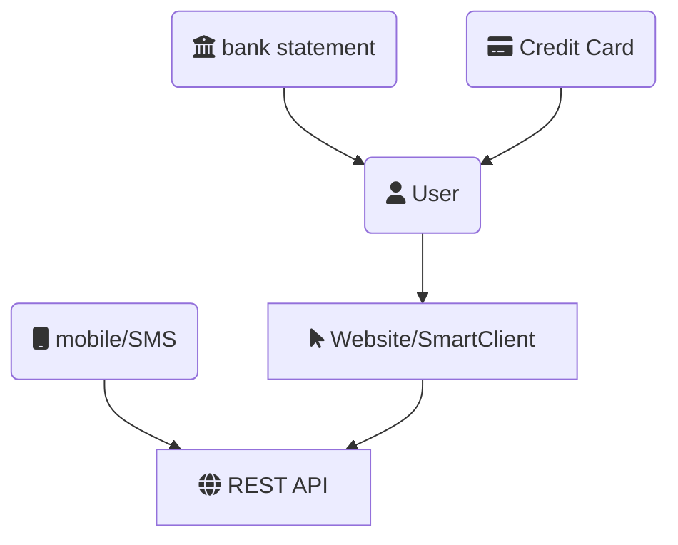

# Marreco Expenses

## Objective

Control personal expenses, using a zero budget approach. Will be developed in  phases (*Expense Tracking* and *Budgeting*)

### Features:

#### Tracking
- Expenses input
- Expenses classification
- Visualize all transaction in a given account
- Insert & Remove Transactions from the account
- When marked as *cleared*, transactions cannot be removed
- The account will have a *current balance* associated with every transaction (running total)
- A account can have a balance marked as *cleared*, making all previous transactions(including) readonly

#### Budgeting *(TBD)*
- Set up categories & subcategories
- Set up budget for each subcategory


### Expenses input
Automate expenses information input using:
- Bank account statements 
- Bank credit card bill statements
- Bank SMS confirmation
- User Input



> Ideally the `bank statement` and `Credit Card` information could have some level of automation


## Domain Model
Entities
- [ ] Account
- [ ] Transaction
 - Expense
 - Transfer
 - Income
- [ ] Budget
- [ ] Assignment

### Account

A account represents any source of money that can spawn transactions (either income or withdraws). It also contains a balance with the remaining money associated with it. 
Each expense subtracts from the balance
Each Income adds to the balance
A Transfer will subtract balance from a origin account, and adds the same balace to a destination account.

### Transaction

A Transaction is a movement of funds on a account, it can be one of:

- **Expense**: Represents a withdraw from a account, it has:
    - A monetary value
    - A Category 
    - A date & time of expense
    - A Location (Lat&Long)
    - A Account

- **Income**: 
    - A monetary value
    - A date & time of expense
    - A Account

- **Transfer**
    - A monetary value
    - A date & time of expense
    - A Origin Account
    - A Destination Account


#### Behaviors:

##### Apply
- Given an Expense, When applied to the account, withdraws the value from the balace of that account
- Given an Income, When applied to the account, deposits the value to the balance of that account
- Given a Transfer, When applied to the origin account, withdraws the value from the balace of that account
- Given a Transfer, When applied to the destination account, deposits the value to the balance of that account

##### Moving
...


```plantuml
class Transaction { 
    Value : Money
    Date : DateTimeOffset
    Description : string[]
    Apply(account)
}
class Expense { 
    Category : Category
    Location : GeoCordinate
    Account : Account
}
class Income { 
    Account : Account
}
class Transfer { 
    Origin : Account
    Destination : Account
}

Transaction <|- Expense 
Transaction <|- Income 
Transaction <|- Transfer 
```


## Use Case:
asdsdan

```plantuml
left to right direction
actor customer
actor 

```


